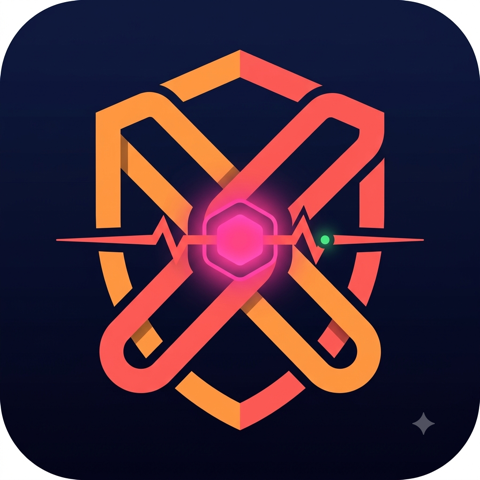

# Flare PayFlow Guard

<p align="center">
  
</p>

[Public repository](https://github.com/Lukeknow0/flare-payflow-guard) · Submission candidate ref: `submission-v1`

Flare PayFlow Guard is a local, read-only FXRP/XRPL direct-mint preflight and receipt guard for **Flare Summer Signal, Bounty 1 — Interoperable Asset Products**.

It turns a structured intent plus block-anchored Coston2/FAssets state into deterministic `PASS`, `REVIEW`, or `BLOCK` output. A fresh live `PASS` only opens `HUMAN_CONFIRMATION_REQUIRED`; the repository has no signer, accepts no private key, and never submits a transaction.

```text
intent
  -> Coston2 Contract Registry -> AssetManagerFXRP -> FTestXRP
  -> anchored settings + Core Vault fees + direct-mint limiter state
  -> policy 2.0.0 PASS / REVIEW / BLOCK
  -> human wallet review only
  -> optional caller-supplied receipt-fact verification
```

Removing the Flare evidence, its raw adapter state, or its anchor/provenance/safety bindings makes a same-process `VERIFY_LIVE_PASS` impossible.

## Verify

Prerequisites: Node.js `>=20`, Python `>=3.10`, and npm. `npm ci` may need registry access on a cold cache; after dependencies are installed, only the fresh Coston2 step needs network access.

```bash
npm ci
make verify-offline
```

`make verify-offline` runs the deterministic suites, verifies both committed T1 live bundles, and exercises fixture-labelled `PASS`, `REVIEW`, and `BLOCK` paths. The current suites contain **32 Node tests and 101 Python tests, 133 total**. The public `submission-v1` ref passes this offline gate; the immutable retained live bundle records the earlier clean candidate that passed full `make verify`.

Fresh, read-only verification is one command:

```bash
make verify
```

That process performs two independent Coston2 captures and then strictly validates two policy decisions. It fails non-zero on RPC, ABI, chain, bytecode, block-anchor, provenance, dependency-lock, evidence-binding, policy, or safety errors; it never falls back to a fixture or mock.

To retain a newly verified pair, use a new directory below `evidence/live/`:

```bash
node scripts/verify-live.mjs \
  --retain-dir evidence/live/<new-directory>
```

The verifier writes `capture-1.json`, `capture-2.json`, `decision-1.json`, `decision-2.json`, and `verification-summary.json` only after both captures and both strict decisions pass. This same-process capture-to-verification path is the project's authenticity entry point. A JSON artifact's SHA-256 self-digest proves internal consistency, not that an arbitrary file came from Flare.

## Replay the committed historical capture

The committed block `32943632` artifact was genuinely captured live from clean pre-public evidence commit `642623c27c89ee15a6fa2c678bd02d95965afaa9`. The corresponding code is retained in the public candidate; because the artifact is now historical, replay it explicitly:

```bash
PYTHONPATH=src python3 -m flare_guard.cli \
  --intent examples/intents/direct-mint-10-xrp.json \
  --evidence evidence/live/runs/preflight-live-2.json \
  --historical-replay
```

Policy `2.0.0` returns `decision=PASS`, audit ID `FLARE-DEB2AA04A4EBB912`, and `execution_eligible=false`. The quote is **10 XRP net** (`10,000,000 UBA`) and **10.2 XRP gross** (`10,200,000 UBA`), including the observed `100,000 UBA` minting fee and `100,000 UBA` executor fee. It also emits the official 32-byte direct-mint memo for recipient `0x...0002`:

```text
4642505266410018000000000000000000000000000000000000000000000002
```

Normal live evaluation uses the policy process's own UTC clock and a fixed 900-second maximum evidence age; the public API accepts no caller-supplied evaluation time. An intent cannot raise that limit. Because self-digesting JSON cannot authenticate its own RPC origin, pure policy output always has `execution_eligible=false`; the same-process live harness reports `VERIFY_LIVE_PASS` only after two fresh captures and decisions pass. Historical replay is also always non-executable.

CLI exit codes are `0=PASS`, `10=REVIEW`, `20=BLOCK`, `64=input error`, and `70=evidence/evaluation error`.

## Receipt claim boundary

The receipt checker consumes facts supplied by its caller; it does not fetch RPC receipts or FDC proofs. EVM `status=1` alone is `REVIEW`, not settlement. `EXECUTED` requires complete preflight expectations plus matching live-verified facts for the anchored AssetManager's `DirectMintingExecuted` event, including transaction/block/emitter, asset, minted amount, fees, and `targetAddress` recipient. Missing preflight bindings, any mismatch, `DirectMintingDelayed`, or `LargeDirectMintingDelayed` cannot prove execution.

## Evidence and review map

- [`evidence/T1_VERIFICATION.md`](./evidence/T1_VERIFICATION.md): two independent Registry/FAssets reads.
- [`evidence/PREFLIGHT_LIVE.md`](./evidence/PREFLIGHT_LIVE.md): the earlier genuine block `32943632` capture.
- [`evidence/live/final-policy2-c665bab-20260717/verification-summary.json`](./evidence/live/final-policy2-c665bab-20260717/verification-summary.json): retained two-capture policy-2 `VERIFY_LIVE_PASS` at block `32945674`.
- [`ARCHITECTURE.md`](./ARCHITECTURE.md): schemas, trust boundaries, policy and Flare-removal tests.
- [`NEW_WORK_EVIDENCE.md`](./NEW_WORK_EVIDENCE.md): Pharos baseline attribution and post-boundary commit map.
- [`PUBLIC_HISTORY.md`](./PUBLIC_HISTORY.md): publication-boundary and pre-public evidence-hash disclosure.
- [`DEMO_SCRIPT.md`](./DEMO_SCRIPT.md): three-minute reviewer walkthrough.
- [`STATUS.md`](./STATUS.md): current completion and approval gates.

The public pre-Flare boundary is branch/ref `pre-flare-import`; the candidate is branch/ref `submission-v1`. Because the original Pharos worktree was dirty before this event, both its committed and local-uncommitted behavior are conservatively treated as baseline in [`provenance/pharos-source.json`](./provenance/pharos-source.json).

## Honest boundary

Implemented: read-only Coston2/FAssets capture, fail-closed policy `2.0.0`, canonical evidence/decision digests, gross-payment and memo construction, caller-supplied receipt verification, 133 tests, and offline/live verification harnesses.

Not implemented or claimed: FDC AddressValidity/Payment retrieval, wallet connection, test-token transaction, custom deployment, automatic signing, a hosted browser application, or DoraHacks submission. The repository is the runnable public artifact; a local three-minute recording is prepared separately and is not stored in Git. Eligibility/KYC and payout details are outside this codebase's technical claims.
